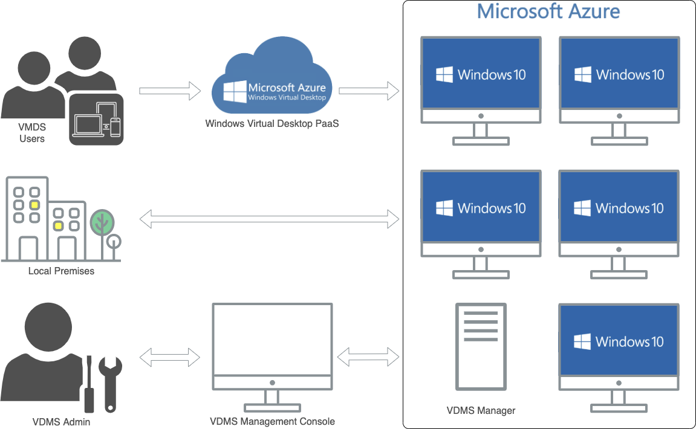

= Starting Steps for VDMS Success
:toc: macro
:hardbreaks:
:toclevels: 2
:nofooter:
:icons: font
:linkattrs:
:imagesdir: ./media/
:keywords:

== What is VDMS?

Virtual Desktop Managed Service (VDMS) is NetApp’s managed DaaS solution that allows you to outsource virtual desktop provisioning, deployment, and infrastructure allowing you to focus on your users and applications for a single monthly fee per user.

[.thumb]

== Setting up VDMS

The VDMS implementation project will consist of the following:

. link:serviceoffering.prerequisites.html[Prerequisites]
. Customer Environment Review Kick Off Call
. NetApp delivers your WVD infrastructure and workspace
. Interactive Live Training Sessions
. Add your data, applications, and users to your customized WVD
. Test the environment, user desktops, and connectivity
. Go Live!

== What’s Next?
To ensure a successful and timely deployment, begin with the steps below:

. Obtain link:serviceoffering.prerequisites.html#m365-licensing[appropriate Microsoft 365 licensing] for your users
. Create a list of VDMS users
. Create a list of applications, media, licenses, and vendor information – note any database or legacy applications that may require special considerations or vendor assistance
. Identify data that will need to be transferred
. If deploying with an existing Active Directory instance, review these link:serviceoffering.prerequisites.html#existing-ad-integration[additional prerequisites]
